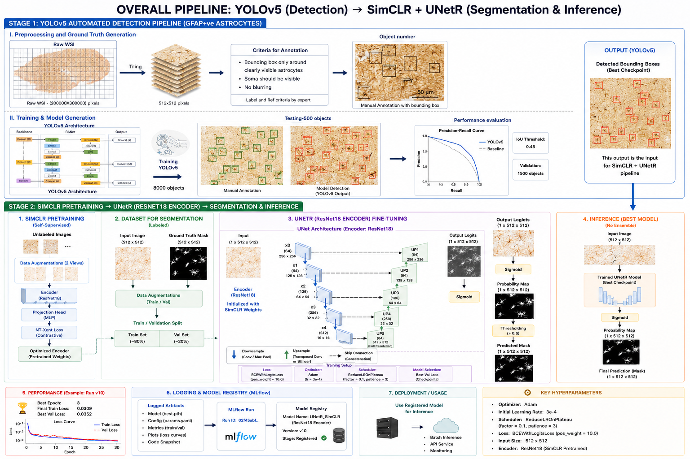
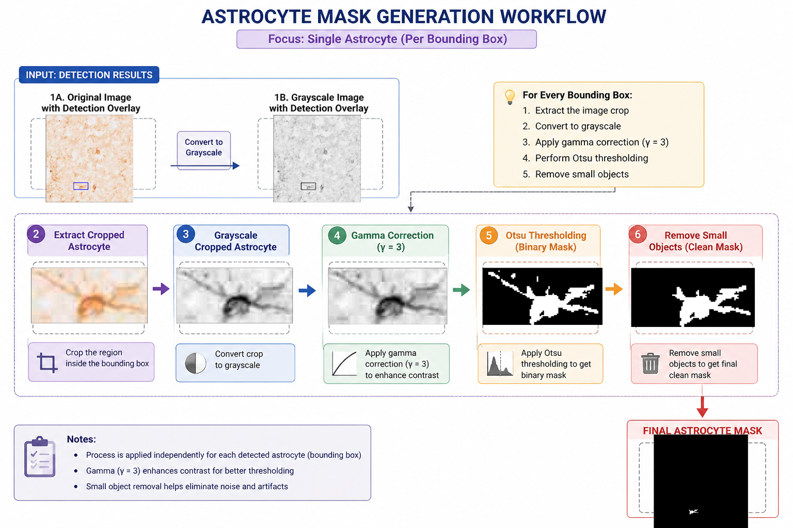
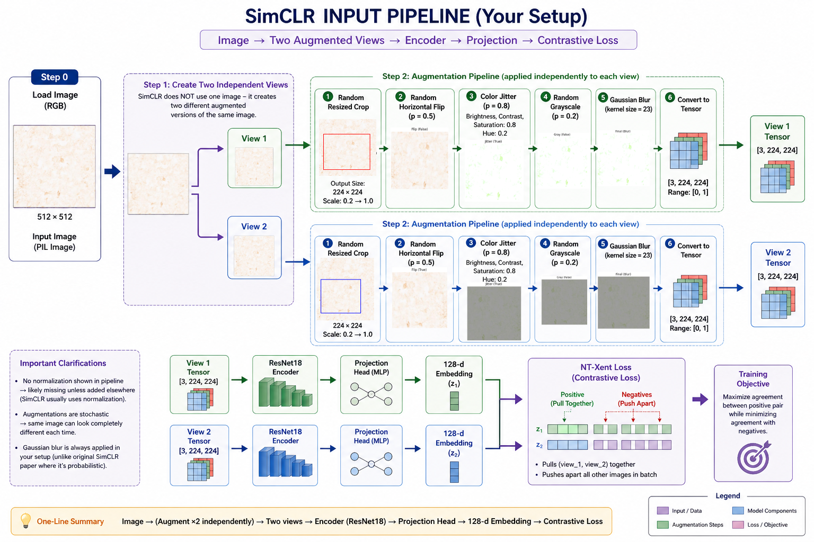

# Self-Supervised Cell Detection and Segmentation in Gigapixel Medical Images

  
  
  
  
  

> An end to end deep learning pipeline that detects and segments cells in gigapixel medical images, using self-supervised pre-training to cut the cost of manual labeling. Built on large-scale human tissue imaging at the Sudha Gopalakrishnan Brain Centre, IIT Madras. This repository documents the system and results; source is held under institutional IP.

## Why this is interesting for an R&D team

- **Self-supervised learning reduces annotation cost.** Pixel-accurate labels are the expensive bottleneck in medical imaging. A contrastive encoder learns from unlabeled tissue first, so the segmentation model trains well from very few labels.
- **It runs at real scale.** A single image can exceed 200,000 by 300,000 pixels. The pipeline tiles, detects, and segments at that resolution rather than on toy crops.
- **It ships.** The trained model is packaged with MLflow and served behind a FastAPI inference API, not left as a notebook.
- **Measured, not asserted.** The best segmentation model reaches a validation loss of 0.0352 and beats a MedSAM baseline (Dice 0.8063).

## Pipeline overview

The image is tiled, candidate cells are detected with YOLOv5, those detections are converted directly into segmentation masks, and a UNet whose encoder was pre-trained with SimCLR produces the final mask used for downstream quantification.

## Stage 1: Detection (YOLOv5)

Each tile is processed at 512 by 512. A YOLOv5 detector is trained on hand-curated cell crops under a strict protocol (box only around clearly visible cells, soma visible, no blurring) and validated at an IoU threshold of 0.45. It recovers cells across morphological variants at high recall while keeping false positives low enough that the detections can seed the next stage. The detector is the supervisory signal for segmentation: its boxes become masks instead of being discarded.

## Stage 2: Masks directly from detections

Instead of a separate weak-label pipeline, segmentation masks are built directly from the detection annotations. For each bounding box the crop is extracted, converted to grayscale, gamma corrected to lift the signal, thresholded with Otsu, cleaned of small objects, and pasted back into a full image binary mask. The result is drop-in ground truth for the UNet with no manual pixel labeling.

## Stage 3: Self-supervised pre-training (SimCLR)

Because labels are scarce, a ResNet18 encoder is first pre-trained on unlabeled tissue tiles with SimCLR contrastive learning. Two augmented views of each tile pass through a shared encoder and a 512 to 128 projection head, and an NT-Xent loss (temperature 0.1) pulls matching views together while pushing others apart.

| Setting | Value |
|---|---|
| Backbone | ResNet18 with MLP projection head (512 to 128) |
| Loss | NT-Xent, temperature 0.1 |
| Augmentations | random resized crop (224), flip, color jitter, grayscale, Gaussian blur |
| Optimizer | LARS, learning rate 1e-3, batch 128, 200 epochs |

The learned weights initialize the segmentation encoder, so the segmenter starts already understanding tissue structure.

## Stage 4: Segmentation (UNet with SimCLR encoder)

The segmentation model is a UNet whose encoder is the SimCLR-pretrained ResNet18. Four upsampling blocks with skip connections recover spatial detail, and a final upsampling layer returns to full 512 by 512 resolution. Training uses BCEWithLogitsLoss with a positive weight of 10 to counter heavy background imbalance.

| Setting | Value |
|---|---|
| Encoder | ResNet18, initialized from SimCLR |
| Loss | BCEWithLogitsLoss, positive weight 10 |
| Optimizer | Adam, learning rate 3e-4, ReduceLROnPlateau |
| Inference | sigmoid then threshold 0.5, optional multi-checkpoint ensemble |

## Results

| Model | Task | Best metric | Notes |
|---|---|---|---|
| UNet with SimCLR | Segmentation | Validation loss 0.0352 | best performing; train loss 0.0309 at epoch 3 |
| MedSAM | Segmentation | Dice 0.8063 | baseline comparison |

The best checkpoint is logged to MLflow and registered in the model registry.

## Deployment

The trained model is packaged with `mlflow.pyfunc` for standardized, versioned inference and served through a FastAPI API (`/api/health`, `/api/get_mask`, `/api/model/info`) with preprocessing applied before inference. Tile size 512 by 512, threshold 0.5, FP32.

## Tech stack

`PyTorch`, `YOLOv5`, `SimCLR (contrastive SSL)`, `UNet / ResNet18`, `OpenCV / scikit-image`, `MLflow`, `FastAPI`, `NumPy / pandas`, `CUDA`

## Why it matters

This is the full arc that an applied research team cares about: a detector that works at gigapixel scale, detection annotations reused as segmentation supervision so no manual pixel labeling is needed, self-supervised pre-training that makes a data-scarce task tractable, and a packaged serving layer. The same pattern of detect, derive masks, pre-train, segment, quantify generalizes to most high-resolution imaging problems in medicine and biology.

Diagrams in `assets/` illustrate the method. Code and trained weights are private under institutional agreements. A technical walkthrough is available on request.
