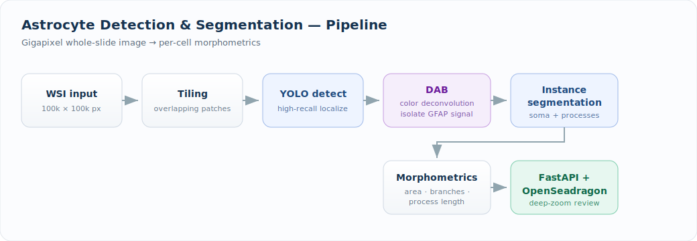

# Astrocyte Detection & Segmentation at Whole-Slide Scale

  
  
  
  
  

> Built at the **Sudha Gopalakrishnan Brain Centre, IIT Madras**, on the institute's large-scale human brain histology archive. This repo documents the system; source is held under institutional IP.

---

## The problem

Human brain histology is acquired as **gigapixel whole-slide images** — a single section can exceed 100,000 × 100,000 pixels. Astrocytes (GFAP-stained glial cells) need to be located and outlined across thousands of these sections to study glial morphology and distribution. Manual annotation is infeasible at this scale, and off-the-shelf cell models fail on the staining and density characteristics of fetal/adult human cortex.

## The approach

A tiled, two-stage pipeline that turns raw whole-slide images into per-cell morphometric data.

1. **Tiling** — the WSI is streamed and split into overlapping patches so detection runs within GPU memory while preserving cells that straddle tile borders.
2. **Detection (YOLO)** — a detector trained on hand-curated GFAP+ astrocyte crops localizes candidate cells at high recall.
3. **Stain separation (DAB color deconvolution)** — the brown DAB chromogen is separated from the hematoxylin counterstain, isolating the GFAP signal before segmentation so morphology isn't corrupted by background staining.
4. **Instance segmentation** — each detected cell is segmented to recover its full process-bearing shape (soma + branches).
5. **Morphometric extraction** — per-cell features (area, branch points, process length, complexity) are computed and written to a structured store.
6. **Serving** — results are exposed through a **FastAPI** backend with an **OpenSeadragon** deep-zoom viewer, so a reviewer can pan a gigapixel slide and see overlaid detections in real time.

## Key results

- Ran the full morphometric pipeline on **4,664 segmented astrocyte crops** from a single fetal brain section *(final, confirmed numbers to be added)*.
- Scales to the centre's archive standard of **~10,000 serial sections per brain** at 20 µm thickness, 0.5 µm/pixel.
- Live **screen-capture overlay** mode for interactive review during pathology sessions.

> _Result figures and quantitative tables will be added here — replace this block with your final overlays + metrics images._
>
> ``

## Tech stack

`PyTorch` · `YOLO` · `OpenCV / scikit-image (color deconvolution)` · `FastAPI` · `OpenSeadragon` · `NumPy / pandas` · `CUDA`

## Why it matters

This is end-to-end ML systems work: a model that performs at gigapixel scale, a stain-aware preprocessing stage grounded in the actual imaging physics, and a serving layer a domain expert can actually use. The same pattern generalizes to any high-resolution biomedical detection problem.

---

Code and trained weights are private under IIT Madras / SGBC institutional agreements. A technical walkthrough is available on request.
